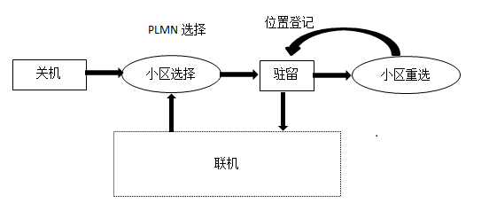

## 要点
 1. 终端工作模式
 2. 待机状态下任务
 3. 驻留？
 4. PLMN种类与选择
 5. 小区选择分几种
 6. 小区重选
 7. 测量？
 8. 小区同步
 9. 位置登记
 10. 寻呼

 ----
# 终端工作模式
待机：休眠与唤醒
联机

# 待机状态

### 待机状态的任务
 1. PLMN选择
 2. 小区选择与重选
 3. 位置登记

PLMN（Public Lands Mobile Network）选择一般发生在开机到待机，覆盖盲区到覆盖区。 
PLMN有归属、等价、漫游、其他之分。等价即同一运营商的不同制式PLMN，服务是相同的。 

上图运作过程当中，小区选择与重选是由终端自主进行，基站不会与终端交互；驻留后终端会与小区同步，即接收小区广播的系统消息，驻留也是单向的，小区的同步机制见后文。 
驻留要求：始终监听网络寻呼；选择最好的小区。

### PLMN选择
又称附着，需要与网络交互，PLMN标识指MCCMNC。 
基于无线侧三大特性：
  1. 工作频段
  2. 频点
  3. PLMN标识

分两个步骤：搜索、注册 
PLMN选择后开始小区选择

### 小区选择
分初始与普通：
  1. 初始小区选择，用于开机后以及覆盖盲区回到覆盖区的PLMN** 搜索 ** 过程。是一个循环过程，知道扫描完所有频段，不需要驻留。此时不确定工作频点。
  2. 普通小区选择，开机后的PLMN注册或者从联机态返回待机态，‘见贤思齐’，最终驻留合适的小区

### 小区重选
在驻留状态下不断进行重选，流程与小区选择类似

# 见与思
即测量与判决

# 小区同步机制
一是终端实现与服务小区在时间上的同步；二是终端实现与服务小区在频率上的同步

# 小区广播机制

# 位置登记与寻呼机制
### 位置区

### 寻呼
使用寻呼帧，对应DRX周期。 
