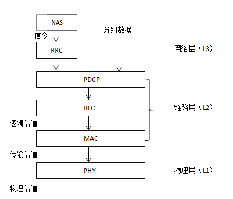

## 要点
 1. 什么是空中接口
 2. 空中接口传递什么，用什么承载
 3. 协议栈
 4. 为什么要定义信道
 5. RRC子层功能，链接怎么建立
 6. PDCP功能，加密
 7. RLC功能，怎么保证传输
 8. RLC三种工作模式差异
 9. MAC功能
 10. 物理层功能
 11. BCCH, PCCH, CCCH, DCCH, DTCH处理路径  

## 问题
信令与业务的概念？
----

# 空中接口
基站（eNB）与终端（UE）间的接口，uu接口。 传输信令和业务数据。

#### 信令
空中接口传输两种信令： 
1. NAS信令，终点是MME，通过SRB（信令承载, Signal Radio Bearer）和S1-CP承载。
2. RRC信令，重点eNB，通过SRB。

#### 业务数据
利用无线承载（RB，Radio Bearer）传输业务数据 
UE ----Radio Bearer---- eNB  
UE ----E-RAB---- SGW (RB+S1 Bearer = E-RAB) 
UE ---EPS Bearer---- PGW (E-RAB + S5/S8 Bearer = EPS)  

#### 分层结构

应用层 <-----------> 应用层  非接入层（NAS）  
网络层 <-----------> 网络层  接入层（AS）     
链路层 <-----------> 链路层                  
物理层 <--空中接口--> 物理层

基站没有非接入层，只负责为MME和终端转发非接入层信令

#### 空中接口结构

与WCDMA空中接口相比，缺少了CS业务。

# 分层功能

### RRC
** TS36.331  **
Radio Resource Control,无线资源分配与控制： 指定信令承载、无线承载；参与待机与联机的多种处理机制。
联机态才会建立RRC连接，通过RRC信令连接UE与eNB。在LTE中RRC连接对应SRB1。

### PDCP
** TS36.323  **
* 控制面：加密和完整性保护
* 用户面：加密、包头压缩和切换支持

加密密钥由UE的USIM卡和网络的HSS数据库保存

### RLC
** TS36.322  **
为上层提供可靠的数据传输业务，保证点到点的可靠传输：分段，重发，重传。
1. 透明传输模式（TM），不保证正确，实时性高，没有分段、重组，如广播与寻址。
2. 非确认模式（UM），携带PDU的编号，实现信息的唯一性，不冲传，如VoIP语言数据包。
3.确认传输模式（AM），分段、重发、充足，如用户数据、信令。

### MAC
Medium Access Control：** TS36.321  **
实现逻辑信道的复用。

### PHY
** TS36.211, TS36.212, TS36.213, TS36.214  **

# LTE空中接口的信息传输
p121
