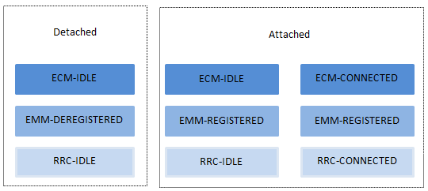

### EPC中的几个概念
EMM： EPS MM，移动性管理,分注册和非注册 
ECM: EPS Connection Managerment，分连接态和空闲态 
EPS承载: UE注册到网络后，需要与外部PDN建立IP连接，这个连接为EPS承载。UE ---EPS Bearer---- PGW (E-RAB + S5/S8 Bearer = EPS) 
RRC: 无线资源控制，处于UE与eNodeB间的控制平面，只处理AS信令，通过SRB（信令承载）；基站本身不处理NAS信令的，通过SRB、S1-CP将其转发至MME。

EPC中的状态如下图：

终端通过附着注册到网络，进入EMM-REGISTERED状态。终端在该状态下，如果MME和终端有信令连接，就处于ECM-CONNECTED状态；没有就处于ECM-IDLE状态，这里的信令连接指UE与eNodeB间的RRC连接还有eNodeB与MME间的S1接口连接。
### 附着
#### 与随机接入的概念澄清
随机接入指终端随时发起、且基站不可预测和控制的获取网络资源、建立业务链接的过程；是终端从待机态切换到联机态的第一个处理过程。它的作用在于终端获取C-RNTI（小区级无线网临时标识）、获得上行同步、上行资源。 
可以是待机状态发起的初始随机接入，附着、位置更新、寻呼响应等。也可以是联机态下发起的随机接入，如切换过程。 

而附着式终端注册到EPC网络的第一个流程，目的在于建立信令连接。 具体任务是终端在PLMN注册并驻留到小区；在MME中建立上下文；为终端建立默认承载 
主要分为4个步骤：
  - 终端选择小区。
  - 随机接入。
  - 初始附着。
  - 资源释放。
